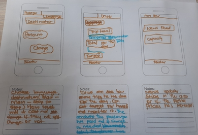

**Group Name**

# The Slackers

**Participants**
* Sibusiso
* Sinoxolo
* Yonnela

* * *

**Images From The Project Planning with the group**

|Pictures | Description |
|---------|--------------|
| | Persona - Sbuda : 28 year old taxi dpriver from Dunoon. Sbuda finished his matric in 2012 and started driving taxis in 2013. Has 2 sisters who stays in Nyanga East, they still in school and he supports them financially.|
| | Persona - Passengers : Township dweller who uses taxis everyday to travel. |
| | First we have Destination Table which will describe the location the passenger is travelling too and the price. Table where the driver can track his target. Last table is where the user can see the transaction |
| | First screen : Passenger can choose his/her destination and the amount it will charge and if the passenger will be getting any change or not. Second screen : Driver will have access to passenger information(How much has the passenger payed and how much will they need to get as a change). Option to view his total trips for the day and his target. Third screen: News feed - Any taxi strike in the area and petrol prices if has increased or not.|
| | Crazy 8 Prototype for our web app. |
| | Workflow for Passengers |
| | Workflow for Driver|